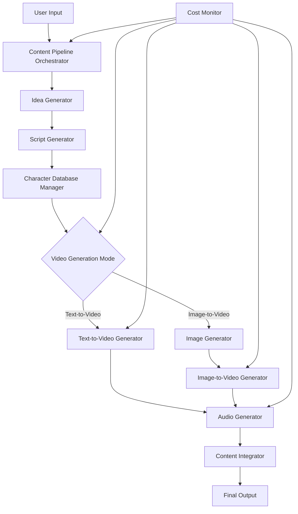

# Design Document

## Overview

The AI Content Generator is a comprehensive multimedia content creation system that leverages Google's Gemini API ecosystem to automatically generate ideas, scripts, videos, and audio. The system follows a pipeline architecture where each stage builds upon the previous one, with built-in cost controls and character consistency management.

The system integrates multiple Gemini services:
- **Gemini Pro/Ultra**: For idea generation and script writing
- **Gemini Vision**: For image generation and analysis
- **Veo**: For video generation (text-to-video and image-to-video)
- **Text-to-Speech API**: For audio narration
- **MusicLM**: For background music generation

## Architecture

### High-Level Architecture



### System Components

The system follows a modular microservice-inspired architecture with the following core components:

1. **Content Pipeline Orchestrator**: Main workflow controller
2. **Gemini API Manager**: Centralized API client with rate limiting
3. **Character Database Manager**: Maintains character consistency
4. **Cost Monitor**: Tracks and controls API usage
5. **Asset Manager**: Handles file storage and retrieval
6. **Content Integrator**: Combines all assets into final output

## Components and Interfaces

### 1. Content Pipeline Orchestrator

**Purpose**: Coordinates the entire content generation workflow

**Key Methods**:
```typescript
interface ContentPipelineOrchestrator {
  generateContent(config: ContentConfig): Promise<ContentResult>
  pauseGeneration(): void
  resumeGeneration(): void
  getProgress(): GenerationProgress
}

interface ContentConfig {
  topic?: string
  maxScenes: number
  budgetLimit: number
  useImageToVideo: boolean
  outputFormats: string[]
}
```

### 2. Gemini API Manager

**Purpose**: Centralized management of all Gemini API interactions with rate limiting and error handling

**Key Methods**:
```typescript
interface GeminiAPIManager {
  generateText(prompt: string, model: string): Promise<string>
  generateImage(prompt: string): Promise<ImageResult>
  generateVideo(prompt: string, referenceImage?: string): Promise<VideoResult>
  generateAudio(text: string, voice: VoiceConfig): Promise<AudioResult>
  estimateCost(operations: APIOperation[]): number
}
```

### 3. Character Database Manager

**Purpose**: Maintains character descriptions and ensures consistency across scenes

**Key Methods**:
```typescript
interface CharacterDatabaseManager {
  addCharacter(name: string, description: string): void
  getCharacterDescription(name: string): string
  updateCharacterDescription(name: string, description: string): void
  getAllCharacters(): Character[]
  generateCharacterPrompt(characters: string[]): string
}

interface Character {
  name: string
  description: string
  referenceImage?: string
  appearances: SceneReference[]
}
```

### 4. Cost Monitor

**Purpose**: Tracks API usage and prevents budget overruns

**Key Methods**:
```typescript
interface CostMonitor {
  trackAPICall(operation: APIOperation, cost: number): void
  getCurrentUsage(): UsageStats
  checkBudgetLimit(plannedOperations: APIOperation[]): boolean
  generateCostReport(): CostReport
}
```

## Data Models

### Core Data Structures

```typescript
interface ContentProject {
  id: string
  topic: string
  idea: string
  script: Script
  characters: Character[]
  scenes: Scene[]
  audioTracks: AudioTrack[]
  finalVideo?: string
  metadata: ProjectMetadata
}

interface Script {
  title: string
  description: string
  scenes: ScriptScene[]
  estimatedDuration: number
}

interface ScriptScene {
  id: string
  description: string
  dialogue: string[]
  characters: string[]
  visualCues: string[]
  duration: number
}

interface Scene {
  id: string
  scriptSceneId: string
  videoPrompt: string
  referenceImage?: string
  generatedVideo?: string
  status: 'pending' | 'generating' | 'completed' | 'failed'
}

interface AudioTrack {
  type: 'narration' | 'music' | 'effects'
  content: string
  duration: number
  volume: number
}
```

## Error Handling

### Error Categories and Strategies

1. **API Rate Limiting**
   - Implement exponential backoff with jitter
   - Queue requests and process them within rate limits
   - Provide user feedback on wait times

2. **API Quota Exceeded**
   - Pause generation and notify user
   - Offer options to continue with different API keys or wait for quota reset
   - Save progress to allow resumption

3. **Content Generation Failures**
   - Retry with modified prompts (up to 3 attempts)
   - Fallback to simpler prompts if complex ones fail
   - Log failures for analysis and improvement

4. **Integration Failures**
   - Provide partial results if some components succeed
   - Offer manual assembly options
   - Generate detailed error reports

### Error Recovery Mechanisms

```typescript
interface ErrorHandler {
  handleAPIError(error: APIError): Promise<ErrorResolution>
  retryWithBackoff(operation: () => Promise<any>, maxRetries: number): Promise<any>
  saveProgressState(project: ContentProject): void
  loadProgressState(projectId: string): ContentProject
}
```

## Testing Strategy

### Unit Testing
- **API Manager**: Mock Gemini APIs to test request formatting and response parsing
- **Character Database**: Test character consistency logic and prompt generation
- **Cost Monitor**: Verify budget calculations and limit enforcement
- **Content Integrator**: Test video/audio synchronization algorithms

### Integration Testing
- **End-to-End Pipeline**: Test complete workflow with mock APIs
- **API Integration**: Test actual Gemini API calls with test accounts
- **Error Scenarios**: Simulate API failures and quota limits
- **Performance**: Test with various content lengths and complexity

### Test Data Management
- Create sample scripts with known character sets
- Prepare test prompts for each Gemini service
- Mock API responses for consistent testing
- Generate test budgets and usage scenarios

### Automated Testing Pipeline
```typescript
interface TestSuite {
  runUnitTests(): Promise<TestResults>
  runIntegrationTests(): Promise<TestResults>
  runPerformanceTests(): Promise<PerformanceResults>
  validateAPIIntegration(): Promise<ValidationResults>
}
```

## Implementation Considerations

### Performance Optimization
- **Parallel Processing**: Generate audio while videos are being created
- **Caching**: Store character descriptions and reuse successful prompts
- **Streaming**: Process scenes as they complete rather than waiting for all
- **Compression**: Optimize video/audio files for faster processing

### Security and Privacy
- **API Key Management**: Secure storage and rotation of Gemini API keys
- **Content Filtering**: Implement content moderation for generated materials
- **Data Privacy**: Ensure user content is not stored longer than necessary
- **Access Control**: Implement user authentication and project isolation

### Scalability Considerations
- **Queue Management**: Handle multiple concurrent generation requests
- **Resource Limits**: Implement per-user quotas and rate limiting
- **Storage Management**: Efficient handling of large video/audio files
- **Monitoring**: Track system performance and API usage patterns